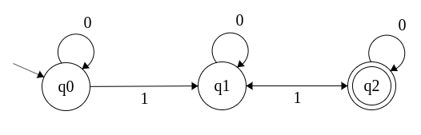

# dfa-machine

A simple implementation of a dynamic finite state machine represinting an instance of a DFA (deterministic finite automata)

[](https://nodei.co/npm/dfa-machine/)

# Installation

Install `dfa-machine` using npm with the command `$ npm install dfa-machine --save`

# Abstract

Any deterministic finite automata is defined by five tuples (Q,Σ,q0,δ,F) where:

- **Q:** The set of all states
- **Σ (sigma):** The set of all accepted inputs
- **q0:** The initial or starting state
- **δ (delta):** The transition function `δ: Q X Σ ⟶ Q`
- **F:** The set of final/accepted states

# Illustration

`dfa-machine` uses the same concept and implements it in javascript as follows:
The constructor of the DFA accpets two arguments:

1. **sigma:** an array of all accepted inputs
   The current version supports inputs of the types `String`, `Number`, and `Boolean` only
2. **machine object:** an object describing initial state, final state(s), all states, and the trnsition functions/course for each state.
   - The key `initial` must be present and have the value of a string represinting the name/key of the initial state which will be provided in the states object.
   - The key `final` must be present and have the value of an array describing the states which will be considered accepted as a final states for a given string to be validated.
   - The key `states` must be present and have the value of an object describing each state as a key (including but not limited to the initial and final states).
     - `states` key must have the value of an object such as `{on: {input1: 'next-state', input2: 'next-state', ...etc}}` which will describe the transition function for each state while reading all inputs to be applied.

# Usage

```js
const DFA = require('dfa-machine');
```

In this example we will create a dfa on `Σ = {0,1}` that accepts strings of length greater than 0 with an even number of `1`s which described in the below figure.



Our states:

- **q0:** The initial state. It represents either an empty string or a string with no `1`s in it _(non-final)_.
- **q1:** Represents an odd number of `1`s _(non-final)_.
- **q2:** Represents an even number of `1`s _(final)_.

With that in mind we will setup our `DFA` instance as follows:

```js
const sigma = [0, 1];

const machineObj = {
  initial: 'q0', // `q0` is the key-name of the initial state provided in `states` object
  final: ['q2'], // `['q2']` is the key-name(s) of the states for the machine to consider final/acceptable to end with (which must be present in `states` key below).
  states: {
    q0: { on: { 0: 'q0', 1: 'q1' } }, // the `on` object will describe the course for the transition function to follow as when recieving input 0 while the state is q0 the next state will be q0
    q1: { on: { 0: 'q1', 1: 'q2' } },
    q2: { on: { 0: 'q2', 1: 'q1' } },
  },
};

const dfa = new DFA(sigma, machineObj);

dfa.validate('1101101001').status; // Valid

// OR

dfa.validate('1101101001');
dfa.status; // Valid
```

# Examples

See more examples here: https://github.com/ahmedisam99/dfa-machine/tree/master/examples

# License

MIT
